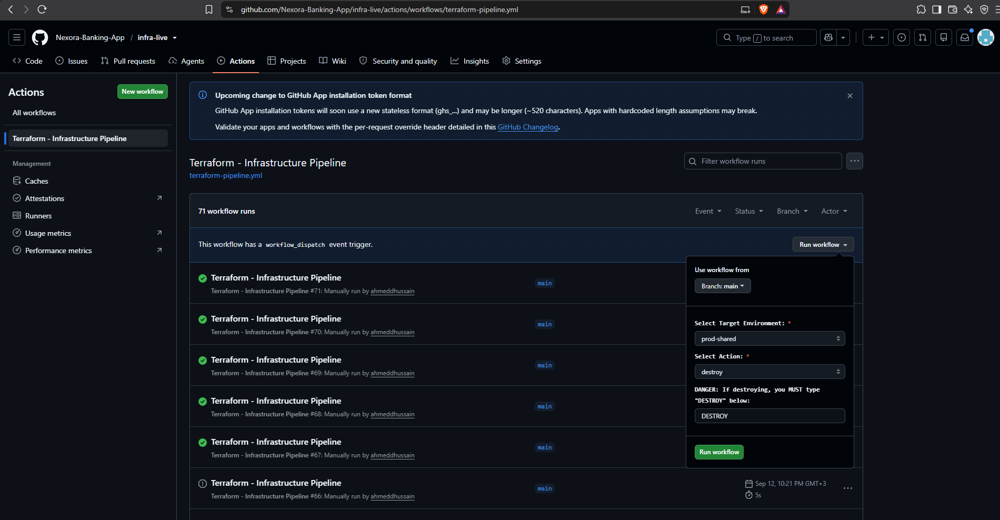

***

# Nexora Core Banking: Infrastructure Execution (`infra-live`)

### Multi-Environment State, CI/CD Pipelines, and GitOps Bootstrapping

**Terraform 1.10+ • AWS S3 Native Locking • GitHub Actions OIDC • Helm**

 

 

This repository is the **State Execution Engine** for the Nexora Enterprise Platform. It calls abstract blueprints from `infra-modules` to construct concrete environments (`prod-shared`, `staging`, `prod`). It implements a fully OIDC-authenticated CI/CD pipeline featuring plan-gated applies, destructive-action safety limits, and a zero-touch ArgoCD cluster bootstrap.

---

## Table of Contents

1. [Architectural Philosophy](#architectural-philosophy)
2. [Current Staging Environment](#current-staging-environment)
3. [Environment Topology](#environment-topology)
4. [State Management & Concurrency](#state-management--concurrency)
5. [CI/CD Deployment Pipeline & Safety Gates](#cicd-deployment-pipeline--safety-gates)
6. [The Terraform-to-GitOps Handoff](#the-terraform-to-gitops-handoff)
7. [Measured Disaster Recovery (DR) Execution](#measured-disaster-recovery-dr-execution)
8. [Real-World Troubleshooting & Solutions](#real-world-troubleshooting--solutions)
9. [Known Gaps & Open Items](#known-gaps--open-items)

---

## Architectural Philosophy

While `infra-modules` defines *how* infrastructure is built, `infra-live` defines *what* infrastructure exists. 

By strictly separating state from blueprints, we enforce blast-radius isolation. Variables like instance sizing, Multi-AZ high availability, and retention policies are injected here. Furthermore, this repository serves as the absolute boundary between **Infrastructure Provisioning** and **Application State**: Terraform's responsibility ends the millisecond the ArgoCD Root Application is injected into the cluster.

### Current Staging Environment

Verified **2026-10-06**. The active Terraform environment is `staging/`:

* EKS cluster `nexora-staging`, Kubernetes `1.33` (live nodes report `v1.33.13-eks-3b4a6ca`), in `us-east-1`.
* Managed node group uses `m7i-flex.large`, desired capacity 2, minimum 1, maximum 3.
* RDS MySQL is `db.t3.micro`, Single-AZ, with one-day automated backup retention.
* Terraform bootstraps the AWS Load Balancer Controller, Istio, Argo Rollouts, Argo CD, and the `platform-bootstrap` root app. Argo CD then reconciles platform and application resources.
* Argo CD `application.resourceTrackingMethod` is `annotation+label`, avoiding ownership collisions with operator-generated resources.

This describes staging only; it does not assert that production is deployed or
healthy.

---

## Environment Topology

The infrastructure is partitioned into distinct state files to minimize cross-domain impact:

* **`prod-shared/`:** The Regional Foundation. Contains the underlying AWS VPC, NAT Gateways, and Route Tables. Decoupling the network from compute ensures that destroying a Kubernetes cluster during a DR drill never drops the corporate network.
* **`staging/`:** The Pre-Production Environment. Runs Kubernetes 1.33 on `m7i-flex.large` nodes (currently two nodes, autoscaling bounds 1–3). Uses a cost-optimized Single-AZ RDS MySQL database (`db.t3.micro`, `multi_az = false`) and one-day backup retention.
* **`prod/`:** Production Terraform configuration is maintained separately. Consult the live production state before assuming deployed size, availability, or recovery characteristics.

---

## State Management & Concurrency

### Terraform 1.10+ Native S3 Locking
This repository utilizes modern Terraform native S3 conditional writes for state locking (`use_lockfile = true`), completely eliminating the cost and maintenance overhead of a separate AWS DynamoDB lock table.
* **State Isolation:** Each environment uses a distinct S3 object key (e.g., `staging/terraform.tfstate`).
* **Cross-State Data Sourcing:** `staging` and `prod` dynamically read VPC and Subnet IDs from the `prod-shared` state file via the `terraform_remote_state` data source, enforcing a clean dependency graph.

---

## CI/CD Deployment Pipeline & Safety Gates

The repository provides a GitHub Actions workflow (`.github/workflows/terraform-pipeline.yml`) for infrastructure changes. The workflow uses GitHub Actions OIDC to obtain AWS credentials; this describes the supported pipeline path and does not itself prove that direct local Terraform access is technically blocked.

### 1. Secretless Authentication (GitHub Actions OIDC)
We utilize **GitHub Actions CI/CD OIDC Federation**. The pipeline runner dynamically requests a short-lived JWT, trading it for AWS STS credentials. *(Note: This is a distinct trust boundary from the EKS cluster's internal IRSA OIDC provider)*.

### 2. Pipeline Security Controls
* **Plan-Gated Execution:** The `apply` action does not execute blindly. It generates a speculative plan (`terraform plan -out=tfplan`) and applies *only* that exact binary artifact, ensuring zero configuration drift between review and execution.
* **Concurrency Locking:** The pipeline enforces `concurrency: terraform-${{ inputs.target_env }}`. If two engineers attempt to modify `staging` simultaneously, GitHub queues the runs to prevent state corruption.
* **Destructive Action Gate:** The `destroy` action requires an explicit, case-sensitive `DESTROY` string input. If the string is missing or incorrect, the pipeline immediately aborts.

---

## The Terraform-to-GitOps Handoff

To achieve a **hands-free cluster boot**, Terraform must cross the boundary into Kubernetes configuration just long enough to install the GitOps operator.

During the `staging` apply, Terraform uses the `helm_release` provider to execute a precise bootstrap sequence:
1. Installs the **AWS Load Balancer Controller** (waiting for webhook readiness).
2. Installs **Istio Base (CRDs)** and **Istiod** control plane.
3. Installs the **Argo Rollouts** controller.
4. Installs **ArgoCD** (baking `--enable-helm` into its ConfigMap natively).
5. Injects the **Root App-of-Apps (`platform-bootstrap`)**.

At this exact step, Terraform's job is complete. ArgoCD awakens, reads the `platform-config` repository, and takes over all subsequent cluster reconciliation (NetworkPolicies, ExternalSecrets, workloads).

---

## Measured Disaster Recovery (DR) Execution

This repository houses the execution mechanism for our platform DR drills.

**Before any manual teardown:** Staging RDS is configured with `skip_final_snapshot = true`, and its Secrets Manager credentials use a zero-day recovery window. A full destroy can irreversibly delete database contents and secrets. Take and verify an RDS snapshot/export and record required secrets first. Kafka EBS volumes have per-volume `Retain` policies; a rebuilt cluster will not automatically adopt them and requires deliberate PV/PVC recovery. Never treat a Terraform destroy as a routine sync or run it without a separate teardown decision.

**Rebuild sequence (only after backup and an explicit teardown decision):**
1. Apply the `staging` Terraform configuration to provision AWS infrastructure and bootstrap the cluster.
2. Verify worker readiness, EBS CSI, External Secrets, and the database before reconciling workloads.
3. Argo CD reconciles platform applications and application manifests from their configured Git revisions.

**Empirical Results:**
* **Previously measured RTO:** **23 minutes, 50 seconds** for an earlier baseline. This historical measurement is not a guarantee for the current Kafka-enabled setup.

---

## Real-World Troubleshooting & Solutions

### 1. Webhook Race Condition Deadlocks
* **Symptom:** During a fresh cluster boot, Helm installs for ArgoCD and Istio failed with `no endpoints available for service "aws-load-balancer-webhook-service"`.
* **Diagnosis:** Terraform attempted to install ArgoCD before the AWS Load Balancer Controller pods were fully online. The Kubernetes API intercepted the ArgoCD Service creation and routed it to the ALB webhook, which timed out.
* **Fix:** Configured `wait = true` on the `aws_load_balancer_controller` Helm release, forcing Terraform to block execution until the controller pods and webhooks reported healthy, effectively sequencing the bootstrap.

### 2. ArgoCD App-of-Apps Unmarshal Error
* **Symptom:** Terraform failed to inject the root ArgoCD application, throwing `cannot unmarshal number into Go struct field ObjectMeta.metadata.name of type string`.
* **Diagnosis:** The `values` block in the `helm_release` used a YAML list `[]` for the `applications` parameter, but the `argocd-apps` Helm chart strictly requires a dictionary/map `{}`.
* **Fix:** Refactored the `yamlencode` block to format `applications = { platform-bootstrap = { ... } }`, passing strict validation.

### 3. Cross-Repository Module Cloning Failures
* **Symptom:** Terraform initialization failed to clone `infra-modules` with a `403 Forbidden` / Not Found error inside GitHub Actions.
* **Diagnosis:** The default `GITHUB_TOKEN` provided to the runner is strictly scoped to the repository executing the workflow. It cannot clone private modules from neighboring repositories.
* **Fix:** The ultimate architectural decision was to make `infra-modules` a public repository, as Terraform modules are reusable blueprints containing no state or secrets, aligning with standard enterprise open-source patterns.

---

## Known Gaps & Open Items

* **Unified OIDC Execution Role:** Currently, the GitHub Actions OIDC federation uses a single IAM role (`NexoraDeployerRole`) across all environments. In a strict production enterprise, this should be segmented into least-privilege per-environment roles (e.g., `StagingDeployerRole`, `ProdDeployerRole`), scoped via IAM condition keys to their respective VPC and cluster ARNs.
* **Lack of Human-in-the-Loop Approval:** The `tf-apply` step runs automatically if triggered via manual workflow dispatch. Leveraging GitHub Enterprise Environment Protection Rules (requiring a manual reviewer click before executing `prod` applies) is recommended, but requires a paid GitHub tier unavailable in this iteration.